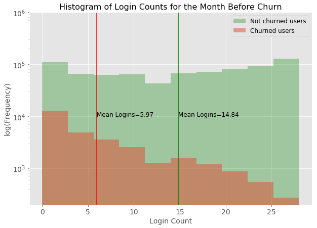
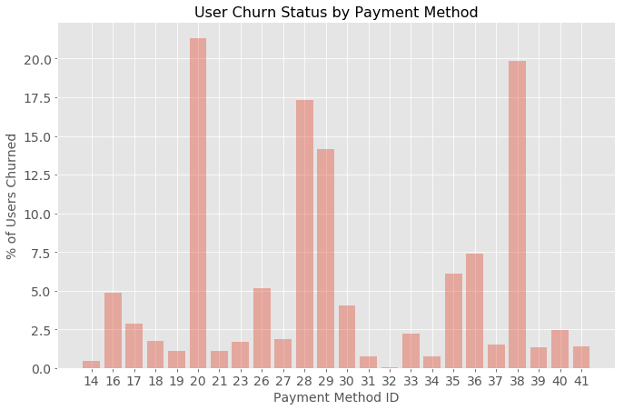
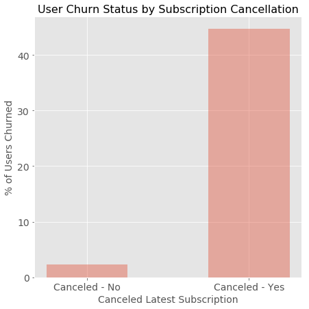
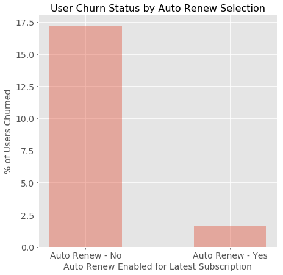
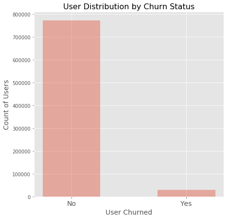

# Churn Prediction: Music Streaming Service

## Abstract

Current studies on customer churn are focused on predicting attrition rather than identifying features leading to attrition. This analysis explores how features leading to customer attrition can be identified and prioritized for an online music service based on a subscription model. Data available for such scenarios typically suffers from class imbalance. Therefore, a significant part of the study was focused on evaluating the performance of different approaches to tackle this problem. Logistic Regression and Random Forest classifiers were evaluated for the problem statement, including tuning to accommodate class imbalance. The optimal model gave an F1 Score of 0.9, and identified features associated with financial activities of the users as being most meaningful in predicting churn.

## Introduction

**Motivation**

Across industries, a key objective of Customer Relationship Management is customer retention, since the cost of customer acquisition is much more than the cost of customer retention (Gallo, 2014). For software companies which operate on a subscription model, the ability to predict customer attrition is even more critical. In this project, we will apply predictive analytics for the music subscription industry, to help predict customers that could be lost. By identifying such customers, companies can make a timely intervention.

**Research Question**

*What customer attributes and behaviors can be used to predict and prevent attrition in the music subscription industry?*

**Literature Review**

The topic of churn prediction has been studied extensively in many different papers across various industries. Euler (2005) used Decision Trees in the telecommunications industry to identify customers who could potentially churn. Larivière & Poel (2005) demonstrated the use of Random Forests to predict customer retention for a financial services company. Shaaban, Helmy, Khedr & Nasr (2012) applied Support Vector Machines for this purpose, on a mobile service provider’s data. Some limitations of the existing practice are:
  * Most studies have been done for the telecommunications and internet service industry, which do not adequately capture the contextual features of a music subscription service.
  * Existing analyses tend to focus on classification algorithms for the churn prediction problem but fall short of identifying customer attributes leading to churn.

## Dataset

Data used in the analysis was provided by KKBOX, a leading music streaming service in Asia. This data was made available by the company as part of a Kaggle competition (11th ACM International Conference on Web Search and Data Mining, 2018). The data can be broadly categorized into the following 3 categories:
  * Usage logs: Music streaming behaviors of the users. Examples are, the total seconds worth of music played by the user, and the number of unique songs that the user listened to partially/fully. These details are captured at a ‘per-login’ level granularity.
  * Transaction logs: Subscription renewal/cancellation related user activities. For instance, whether auto-renew was enabled by the customer, and the membership expiration date.
  * Membership information: Demographic information about the users. These include the user’s geographical location, age and gender among other attributes.

**Churn Criteria**

*A user x in a month y is considered churned if his/her subscription expired in month y-1, and there were no additional transactions for user x within 30 days of the expiry date.*

**Data Preparation**

Several pre-processing steps were performed before the analysis:
  * March 2017 was chosen as the target month for predicting churn. Based on the definition of the churn criteria, this meant assigning ‘churned’/‘not churned’ labels for users whose subscription was due to expire in Feb 2017. Other users were tagged ‘not churned’. 
  * Next, a time frame for the analysis of usage and transaction logs was defined. To simplify this analysis, it was assumed that a period of 6 months up to the subscription expiry month can be considered meaningful for churn prediction. Therefore, the usage and transaction logs were filtered to contain data from September 2016 through to February 2017.
  * Following this step, we aggregated usage and transaction logs so that each row in these datasets corresponds to one user. For usage logs, we chose features such as ‘mean of total seconds of music tuned in to’, and ‘mean of number of songs listened to for 25% of the song duration’. For transaction logs, example features included ‘latest payment plan days’, and ‘total count of payments’. Membership information was already at a ‘per-user’ level, so such aggregation did not have to be performed. Across all 3 types of data, features based on calendar date were broken down into meaningful components like, month of the year, day of the week and week of the year. The final ‘Baseline Dataset’ had features as described in the previous steps, along with churn labels assigned for the users.
  * Further feature engineering was performed on this dataset when it was seen that the results of the analysis models were poor (as discussed in the approach section). As part of this step, features based on usage logs were broken down into multiple month-level features. So, for instance, a feature ‘total_seconds’ in the baseline dataset was transformed into ‘total_seconds_t-1’…‘total_seconds_t-6’, where t = 0 indicates our churn prediction month, i.e. March 2017. Lastly, categorical variables such as gender, city, payment method were one-hot encoded since scikit-learn’s Random Forest classifier does not automatically handle categorical features with more than two levels. Methods discussed in the approach below, referring to ‘Dataset with Engineered Features’ imply using this enhanced dataset.
  
**Exploration**

Figure 1. Histogram of login counts for users in the month before churn (Feb 2017). The plot shows that users who churn have fewer logins, on average.

Figure 2. The proportion of users that churned for some payment methods was higher. The dataset does not provide names corresponding to payment method IDs.

Figure 3. Users that canceled their latest subscription had a higher percentage of churn (more than 40%) compared to users that did not (less than 5%).

Figure 4. Users that had auto-renew enabled for their latest subscription had a higher percentage of churn (around 17%) compared to users that did not (less than 2.5%).

Figure 5. The data has a significant imbalance between users that churned (4%) and those that didn’t (96%).

## Approach

Describe the class imbalance issue, methods, and the WHY of all the steps taken in the project.

### Challenge?

### Logistic Regression

### Logistic Regression, with Feature Engineering

### Logistic Regression, with defined Class Weights

### Logistic Regression, with Synthetic Minority Oversampling Technique (SMOTE)

### Random Forest

### Random Forest, with defined Class Weights

## Results

Key results along with feature importance, and their interpretation.

## Conclusion

Conclude along with limitations, recommendations, and any related ethical issues that should be considered. Prescribe the future course of actions.

## References

as suggested by the heading...
